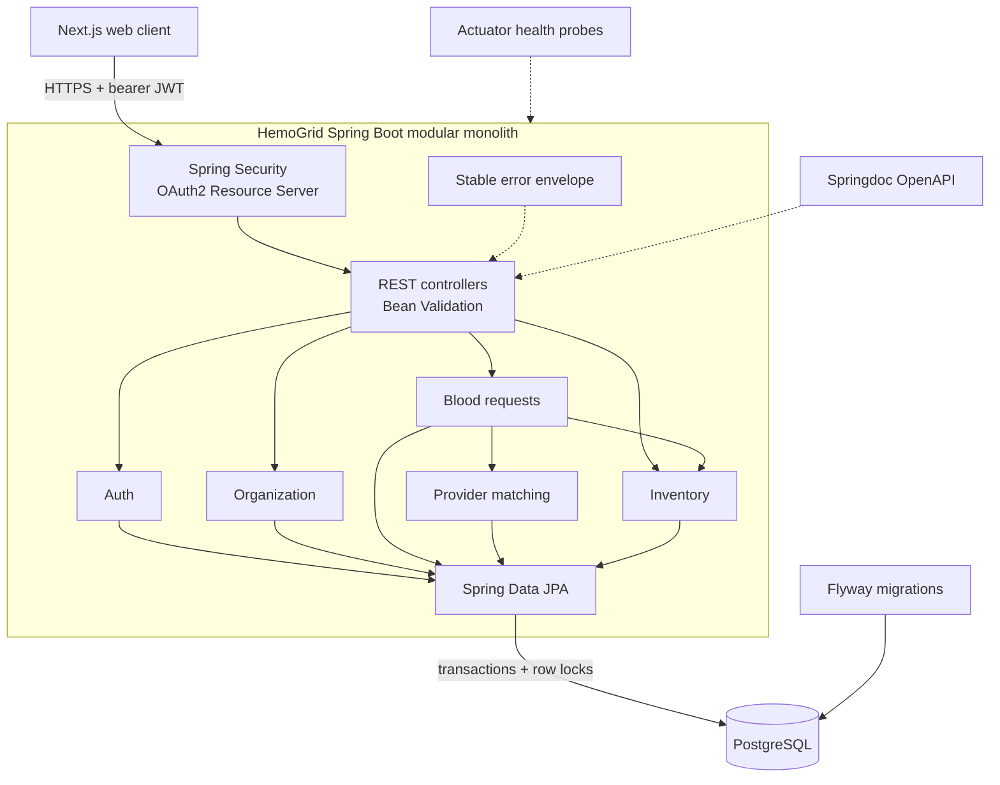
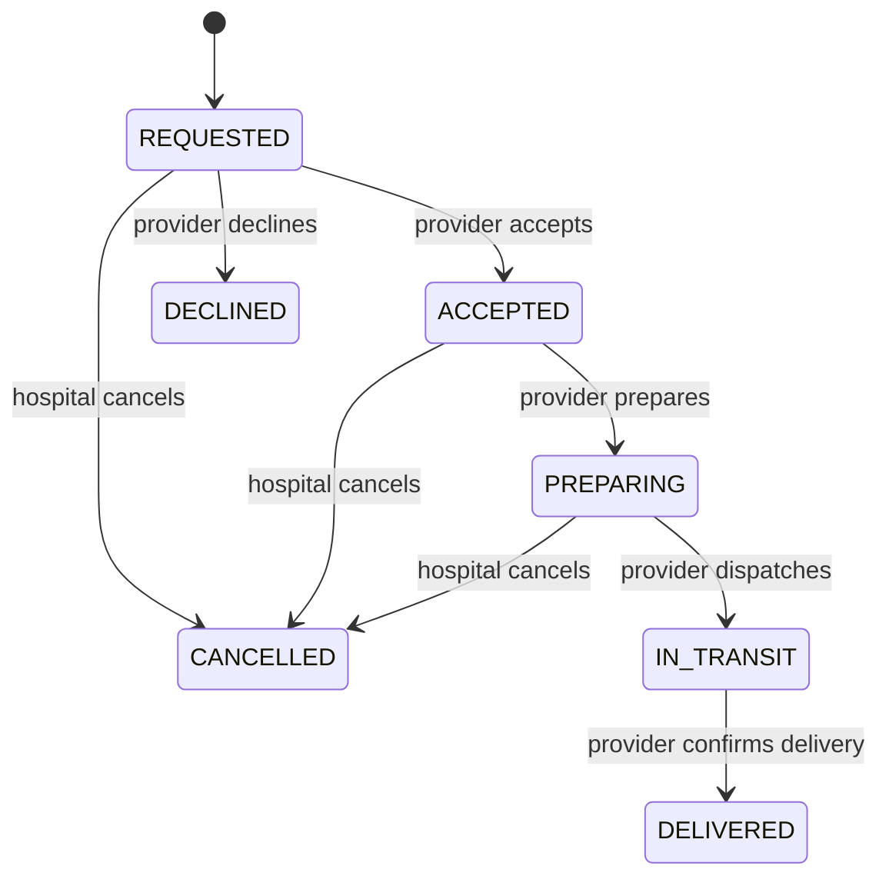

# HemoGrid Backend


HemoGrid is a Spring Boot API for coordinating urgent blood requests between
hospitals and blood-bank providers. It turns a request into a controlled
workflow: find eligible providers, select one, reserve stock safely, track
fulfilment, and consume the reservation on delivery.

This repository contains the backend. The companion Next.js application is in
the [HemoGrid frontend repository](https://github.com/dennisikechukwu/hemo-grid-frontend).

> HemoGrid is currently a portfolio and learning project. It is not a certified
> medical system and must not be used for real clinical decisions in its present
> form.

## Why this project exists

Blood coordination is more than storing request records. The backend must keep
each organization's data isolated, rank providers from current inventory, stop
two actions from reserving the same units, and allow only valid lifecycle
transitions.

HemoGrid models those concerns explicitly:

- Hospital users create and manage requests belonging to their organization.
- Blood-bank users see only requests assigned to their organization.
- Matching prioritizes providers that can fulfil the complete request, then
  known distance, available stock, and facility name.
- Acceptance locks both the request and matching inventory row before reserving
  units.
- Delivery consumes reserved stock; eligible cancellation releases it.
- JWT authentication, validation, and a stable error contract give the frontend
  predictable API behaviour.

## Architecture

HemoGrid is a domain-oriented modular monolith. It keeps one deployable Spring
Boot service while separating business capabilities into modules with API,
application, domain, and persistence boundaries.



### Request and inventory lifecycle



The provider's stock is reserved on `ACCEPTED`. A cancellation from an eligible
state releases that reservation, while `DELIVERED` permanently subtracts the
reserved quantity from available inventory. `EXPIRED` exists in the domain
vocabulary but automated expiry is not implemented yet.

### Modules

| Module | Responsibility |
| --- | --- |
| `auth` | Credential verification, JWT creation, current-user and role checks |
| `organization` | Hospital and blood-bank tenant identity |
| `inventory` | Provider stock, free/reserved quantities, and locked updates |
| `matching` | Exact blood-group/component candidates ranked by capacity and distance |
| `request` | Hospital/provider workflows, assignment, reservations, and state transitions |
| `common.exception` | Consistent business, validation, authentication, and authorization errors |
| `config` | Security, CORS, JSON, JWT, OpenAPI, and operational configuration |

### Important design decisions

| Decision | Reason |
| --- | --- |
| Modular monolith | Preserves clear domain boundaries without premature distributed-system complexity |
| PostgreSQL as the test and runtime database | Exercises the same locking, constraints, and transaction semantics used by the application |
| Flyway migrations + Hibernate `validate` | Makes schema evolution explicit and prevents Hibernate from silently changing production tables |
| Organization-scoped queries | Enforces tenant boundaries inside application use cases, not only in the UI |
| Pessimistic locks during acceptance | Prevents concurrent provider actions from double-reserving a request or inventory row |
| Stable error envelope | Lets the frontend handle validation and business failures consistently |
| Stateless JWT security | Keeps the REST API horizontally deployable and separates authentication state from server memory |

## Technology stack

- Java 21
- Spring Boot 4.1
- Spring Web MVC and Bean Validation
- Spring Security and OAuth2 Resource Server JWT support
- Spring Data JPA / Hibernate
- PostgreSQL 17
- Flyway
- Springdoc OpenAPI / Swagger UI
- Spring Boot Actuator
- Maven Wrapper
- Docker and Docker Compose

## API overview

All endpoints use the `/api/v1` prefix. Apart from login and documented
operational endpoints, requests require `Authorization: Bearer <token>`.

| Audience | Method | Endpoint | Purpose |
| --- | --- | --- | --- |
| Public | `POST` | `/auth/login` | Authenticate and issue a JWT |
| Authenticated | `GET` | `/auth/me` | Return the current user |
| Authenticated | `GET` | `/organizations/me` | Return the current organization |
| Hospital | `POST` | `/blood-requests` | Create a blood request |
| Hospital | `GET` | `/blood-requests` | List the hospital's requests |
| Hospital | `GET` | `/blood-requests/{requestId}` | Read one hospital request |
| Hospital | `GET` | `/blood-requests/{requestId}/candidates` | Get ranked provider candidates |
| Hospital | `POST` | `/blood-requests/{requestId}/select-provider` | Assign an eligible provider |
| Hospital | `POST` | `/blood-requests/{requestId}/cancel` | Cancel while the lifecycle allows it |
| Blood bank | `GET` | `/inventory` | List the provider's inventory |
| Blood bank | `PUT` | `/inventory/{inventoryId}` | Replace an inventory row's available units |
| Blood bank | `PATCH` | `/inventory/{inventoryId}/units` | Update an inventory row's available units |
| Blood bank | `GET` | `/provider/requests` | List requests assigned to the provider |
| Blood bank | `GET` | `/provider/requests/{requestId}` | Read one assigned request |
| Blood bank | `POST` | `/provider/requests/{requestId}/accept` | Accept and reserve inventory |
| Blood bank | `POST` | `/provider/requests/{requestId}/decline` | Decline a requested assignment |
| Blood bank | `POST` | `/provider/requests/{requestId}/status` | Progress preparation, transit, and delivery |

The complete interactive contract, including schemas and response codes, is
available through Swagger UI after the application starts.

### Error contract

Controllers and Spring Security return the same general JSON shape so clients
do not need separate parsing strategies for business and authentication errors.

```json
{
  "timestamp": "2026-08-25T10:15:30Z",
  "status": 409,
  "error": "CONFLICT",
  "code": "INSUFFICIENT_INVENTORY",
  "message": "The selected blood bank no longer has enough free units to accept this request.",
  "path": "/api/v1/provider/requests/{requestId}/accept",
  "fieldErrors": []
}
```

Validation failures populate `fieldErrors`; other failures return an empty
array. The exact `code` and message depend on the failed invariant.

## Run locally

### Requirements

- JDK 21
- Docker Desktop or another Docker-compatible runtime
- Ports `5432`, `5050`, and `8080` available

### 1. Clone the repository

```bash
git clone https://github.com/dennisikechukwu/hemo-grid-backend.git
cd hemo-grid-backend
```

### 2. Start PostgreSQL and pgAdmin

```bash
docker compose up -d
docker compose ps
```

Local services:

| Service | Address | Credentials |
| --- | --- | --- |
| PostgreSQL | `localhost:5432/hemogrid` | `hemogrid` / `hemogrid` |
| pgAdmin | <http://localhost:5050> | `dennis@hemogrid.com` / `dennis` |

When registering PostgreSQL inside pgAdmin, use `postgres` as the host because
pgAdmin connects over the Docker Compose network, not through your Mac's
`localhost`.

### 3. Configure the application

The JWT signing secret must contain at least 32 bytes.

```bash
export JWT_SECRET=local-development-jwt-secret-with-at-least-32-bytes
```

The checked-in defaults already target the local Compose database. For custom
settings, export any of the variables in the configuration table below.

### 4. Start Spring Boot

```bash
./mvnw spring-boot:run
```

Open:

- Swagger UI: <http://localhost:8080/swagger-ui.html>
- OpenAPI JSON: <http://localhost:8080/v3/api-docs>
- Health: <http://localhost:8080/actuator/health>
- Readiness: <http://localhost:8080/actuator/health/readiness>

### Demo accounts

These accounts are seeded for local development only and must never be reused
in a deployed environment.

| Persona | Email | Password |
| --- | --- | --- |
| Hospital | `hospital.demo@hemogrid.local` | `HospitalDemo123!` |
| Blood bank | `bank.demo@hemogrid.local` | `BankDemo123!` |
| Platform admin | `admin.demo@hemogrid.local` | `AdminDemo123!` |

For a complete hospital-to-provider Swagger walkthrough, follow the
[local backend runbook](docs/LOCAL_BACKEND_RUNBOOK.md).

## Configuration

| Environment variable | Required in production | Local default | Description |
| --- | --- | --- | --- |
| `DB_URL` | Yes | `jdbc:postgresql://localhost:5432/hemogrid` | PostgreSQL JDBC URL |
| `DB_USERNAME` | Yes | `hemogrid` | Database user |
| `DB_PASSWORD` | Yes | `hemogrid` | Database password |
| `JWT_SECRET` | Yes | None | HMAC signing secret of at least 32 bytes |
| `JWT_ISSUER` | No | `hemogrid-api` | Expected token issuer |
| `JWT_ACCESS_TOKEN_MINUTES` | No | `480` | Access-token lifetime in minutes |
| `CORS_ALLOWED_ORIGINS` | Yes | `http://localhost:3000,http://localhost:5173` | Comma-separated exact client origins |
| `PORT` | Supplied by Render | `8080` | HTTP port; takes precedence over `SERVER_PORT` |
| `SERVER_PORT` | No | `8080` | Local server-port override |

Do not commit `.env` files or production credentials. Rotate all local/demo
secrets before a public deployment.

## Testing

The repository currently contains 20 integration tests across authentication,
the HTTP/error contract, organization isolation, inventory, matching, request
transitions, and concurrent provider acceptance.

Use a dedicated disposable PostgreSQL database because the integration setup
restores known fixtures:

```bash
export DB_URL=jdbc:postgresql://localhost:5432/hemogrid_test
export DB_USERNAME=hemogrid
export DB_PASSWORD=hemogrid
export JWT_SECRET=test-jwt-secret-with-at-least-32-bytes
./mvnw test
```

Never run the test fixture reset against a database containing data that must
be retained. See [backend testing](docs/TESTING.md) for the rationale and scope.

## Project structure

```text
src/main/java/com/sentinel/hemo_grid/
├── auth/                 # Login, JWT issuance, users and roles
├── organization/         # Hospital and blood-bank tenant model
├── inventory/            # Available/reserved inventory invariants
├── matching/             # Capacity and distance-based provider ranking
├── request/              # Hospital/provider workflow and lifecycle
├── common/exception/     # Shared API errors and exception mapping
└── config/               # Security, CORS, OpenAPI and JSON configuration

src/main/resources/
├── application.yaml      # Environment-driven runtime configuration
└── db/migration/         # Versioned Flyway migrations

src/test/java/            # PostgreSQL-backed integration tests
docs/                     # Runbooks, design notes and deployment guidance
```

Within each business module, packages follow the direction
`api -> application -> domain/persistence`. Controllers translate HTTP,
application services coordinate use cases and transactions, domain objects
protect business invariants, and repositories own database access.

## Deployment direction

The intended production topology is:

- Vercel for the Next.js frontend
- Render for this Dockerized Spring Boot service
- Neon for managed PostgreSQL

The repository already includes a multi-stage Java 21 `Dockerfile`, graceful
shutdown, environment-driven `PORT`, health/readiness probes, Flyway startup
migrations, and exact-origin CORS configuration. Cloud resources and live URLs
are intentionally deferred until the deployment phase.

Read [deployment preparation](docs/DEPLOYMENT_PREPARATION.md) before publishing
the service.

## Documentation

- [Architecture notes](docs/ARCHITECTURE.md)
- [Local backend runbook](docs/LOCAL_BACKEND_RUNBOOK.md)
- [Testing strategy](docs/TESTING.md)
- [Code-review guide](docs/CODE_REVIEW_GUIDE.md)
- [Deployment preparation](docs/DEPLOYMENT_PREPARATION.md)
- [LinkedIn launch draft](docs/LINKEDIN_POST.md)

## Current scope and roadmap

Implemented now:

- Seeded hospital, blood-bank, and admin identities
- JWT login and authenticated identity endpoints
- Organization-scoped hospital and provider workflows
- Inventory management and ranked provider matching
- Concurrency-safe reservation and fulfilment lifecycle
- Stable API errors, OpenAPI documentation, health probes, and integration tests

Planned next:

- Organization and user onboarding instead of seed-only accounts
- Administrative management workflows
- Refresh-token/password-recovery strategy
- Notification delivery and real-time updates
- Production observability, rate limiting, audit history, and cloud deployment

## Author

Built by [Dennis Ikechukwu](https://github.com/dennisikechukwu) as a practical
full-stack engineering project focused on API design, domain modelling,
concurrency, testing, and production-minded deployment.
